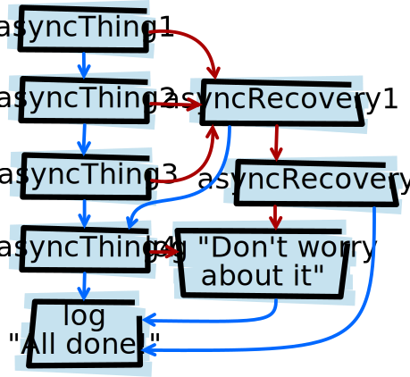

原文：[JavaScript Promises: an introduction](http://www.html5rocks.com/en/tutorials/es6/promises/)
作者：[Jake Archibald](http://www.html5rocks.com/profiles/#jakearchibald)
翻译：[Amio](./#)
转自：[司徒](https://www.cnblogs.com/rubylouvre/p/3495286.html)

女士们先生们，请准备好迎接 Web 开发历史上一个重大时刻......

[鼓声响起]

> JavaScript 有了原生的 Promise!

[漫天的烟花绽放，人群沸腾了]

这时候你大概是这三种人之一：

- 你的身边拥挤着欢呼的人群，但是你却不在其中，甚至你还不大清楚"Promise"是什么。你耸耸肩，烟花的碎屑在你身边落下。这样的话，不要担心，我也是花了多年的时间才明白 Promise 的意义，你可以从[入门简介：他们都在激动什么？](#他们都在激动什么？)开始看起。
- 你一挥拳！太赞了对么！你已经用过一些 Promise 的库，但是所有这些第三方实现在 API 上都略有差异，JavaScript 官方的 API 会是什么样子？看[这里：Promise 术语]！
- 你早就知道了，看着那些欢呼雀跃的新人的你的嘴角泛起一丝不屑的微笑。你可以安静享受一会优越感，然后直接去看[API 参考]吧。

## 他们都在激动什么？

JavaScript 是单线程的，这意味着任何两句代码都不能同时运行，他们得一个接一个来。在浏览器中，JavaScript 和其它任务共享一个线程，不同的线程略有差异，但大体上这些和 JavaScript 共享线程的任务包括重绘、更新样式、用户交互等，所有这些任务操作都会阻塞其他操作。

作为人类，你是多线程的。你可以多个手指同时敲键盘，也可以一边开车一边电话。唯一的全局阻塞函数就是打喷嚏，打喷嚏期间所有其他事务都会暂停。很烦人对么？尤其当你在开着车打着电话的时候。我们都不喜欢这样打喷嚏的代码。

你应该会用事件 + 回调的办法来处理这类情况：

```js
var img1 = document.querySelector('.img-1')

img1.addEventListener('load', function () {
  // woo yey image loaded
})

img1.addEventListener('error', function () {
  // argh everything's broken
})
```

这样就不打喷嚏了。我们添加几个监听函数，请求图片，然后 JavaScript 就停止运行了，直到触发某个监听函数。

上面的例子中唯一的问题是，事件有可能在我们绑定监听器之前就已经发生了，所以我们先要检查图片的`complete`属性：

```js
var img1 = document.querySelector('img-1')

function loaded() {
  // woo yey image loaded
}

if (img1.complete) {
  loaded()
} else {
  img1.addEventListener('load', loaded)
}
img1.addEventListener('error', function () {
  // argh everything's broken
})
```

这样还不够，如果在监听函数之前图片加载发生错误，我们的监听函数还是白费，不幸的是 DOM 也没有为这个需求提供解决办法。而且，这还只是处理一张图片的情况，如果有一堆图片要处理就更麻烦了。

## 事件不是万金油

事件机制最适合处理在同一个对象上反复发生的事情————keyup、touchstart 等等。你不需要考虑当绑定事件之前发生的事情，当碰到异步请求成功/失败的时候，你想要的通常是这样：

```js
img1
  .callThisIfLoadedOrWhenLoaded(function () {
    // loaded
  })
  .orIfFailedCallThis(function () {
    // failed
  })

// and ...
whenAllTheseHaveLoaded([img1, img2])
  .callThis(function () {
    // all load
  })
  .orIfSomeFailedCallThis(function () {
    // one or more failed
  })
```

这就是 Promise。如果 HTML 图片元素有一个`ready()`方法的话，我们就可以这样：

```js
img1.ready().then(
  function () {
    // loaded
  },
  function () {
    // failed
  },
)

// and ...
Promise.all([img1.ready(), img2.ready()]).then(
  function () {
    // all loaded
  },
  function () {
    // one or more failed
  },
)
```

基本上 Promise 还是有点像事件回调的，除了：

- 一个 Promise 只能成功或失败一次，并且状态无法改变（不能从成功变为失败，反之亦然）
- 如果一个 Promise 成功或者失败之后，你为其添加针对成功/失败的回调，则相应的回调函数会立即执行

这些特性非常适合处理异步操作的成功/失败情景，你无需担心事件发生的时间点，而只需对其做出响应。

## 相关术语

[Domenico Denicoia](https://twitter.com/domenic)审阅了本文初稿，给我在术语方面打了个"F",关了禁闭并且责令我打印 [States and Fates](https://github.com/domenic/promises-unwrapping/blob/master/docs/states-and-fates.md)一百遍，还写了一封家长信给我父母。即便如此，我还是对术语有些迷糊，不过基本上应该是这样：

一个 Promise 的状态可以是：

**确认（fulfilled）** - 成功了
**否定（rejected）** - 失败了
**等待（pending）** - 还没有确认或者否定
**结束（settled）** - 已经确认或者否定了

规范里还使用"thenable"来描述一个对象是否是"类 Promise"（拥有名为"then"的方法）的。这个术语是我想起来前英格兰足球经理[Terry Venables](http://en.wikipedia.org/wiki/Terry_Venables),所以我尽量少使用它。

## JavaScript 有了 Promise

其实已经有一些第三方库实现了 Promise：

- [Q](https://github.com/kriskowal/q)
- [when](https://github.com/cujojs/when)
- [WinJS](http://msdn.microsoft.com/en-us/library/windows/apps/br211867.aspx)
- [RSVP.js](https://github.com/tildeio/rsvp.js)

上面这些库和 JavaScript 原生 Promise 都遵守一个通用的、标准化的规范：
[Promise/A+](https://github.com/promises-aplus/promises-spec),jQuery 有一个类似的方法叫 [Deferreds](http://api.jquery.com/category/deferred-object/),但不兼容 Promise/A+规范，于是会[有一点小问题](https://thewayofcode.wordpress.com/tag/jquery-deferred-broken/)，使用需谨慎。jQuery 还有一个 [Promise 类型](http://api.jquery.com/Types/#Promise),但只是 Defereds 的缩减版，所以也会有同样的问题。

尽管 Promise 的各路实现遵循同一规范，它们的 API 还是各不相同。JavaScript Promise 的 API 比较接近 RSVP.js，如下创建 Promise：

```js
var promise = new Promise(function(resolve,reject){
  // do a thing,possibly async,then...

  if(/* everything turned out fine */){
    resolve("Stuff worked!")
  }else{
    reject("It broken")
  }
})
```

Promise 的构造器接受一个函数作为参数，它会传递给这个回调函数两个变量 resolve 和 reject。在回调函数中做一些异步操作，成功之后调用 resolve，否则调用 reject。

调用 reject 的时候传递给它一个 Error 对象只是个惯例并非必需，这和经典的 JavaScript 中的 throw 一样。传递 Error 对象的好处是它包含了调用堆栈，在调试的时候会用点好处。

现在来看看如何使用 Promise：

```js
promise.then(
  function (result) {
    console.log(result) // "Stuff worked!"
  },
  function (err) {
    console.error(err) //Error: "It broke"
  },
)
```

`then`接受两个参数，成功的时候调用一个，失败的时候调用另一个，两个都是可选的，所以你可以只处理成功的情况或者失败的情况。
JavaScript Promise 最初以 "Futures" 的名称归为 DOM 规范，后来改名为"Promise",最终纳入 JavaScript 规范。将其加入 JavaScript 而非 DOM 的好处是方便非浏览器环境使用，如 Node.js（他们会不会在核心 API 中使用就是另外一回事了）。

## 浏览器支持和 Polyfill

目前的浏览器已经（部分）实现了 Promise。

用 Chrome 的话，就像个 Chroman 一样装上 Canary 版，默认启用了 Promise 支持。如果是 Firefox 的拥趸，安装最新的 nightly build 也一样。

不过这两个浏览器的实现都还不够完整彻底，你可以在 bugzilla 上跟踪 Firefox 的最新进展或者到 Chromium Dashboard 查看 Chrome 的实现情况。

要在这两个浏览器上达到兼容标准 Promise，或者在其他浏览器以及 Node.js 中使用 Promise，可以看看这个 [polyfill](https://github.com/jakearchibald/ES6-Promises/blob/master/README.md)（gzip 之后 2k）

## 与其他库的兼容性

JavaScript Promise 的 API 会把任何包含有`then`方法的对象当作“类 Promise”（或者用术语来说就是 thenable。叹气）的对象，这些对象经过`Promise.cast()`处理之后就和原生的 JavaScript Promise 没有任何区别了。所以若果你使用的库返回一个 Q Promise，那没问题，无缝融入新的 JavaScript Promise。

尽管，如前所述，jQuery 的 Deferred 对象有点...没什么用，不过幸好可以转换成标准 Promise，你最好一拿到对象就马上加以转换：

```js
var jsPromise = Promise.cast($.ajax('/whatever.json'))
```

这里 jQuery 的`$.ajax`返回一个 Deferred 对象，含有`then`方法，因此`Promise.cast`可以将其转换为 JavaScript Promise。不过有时候 Deferred 对象会给它的回调函数传递多个参数，例如：

```js
var jqDeferred = $.ajax('/whatever.json')

jqDeferred.then(
  function (response, statusText, xhrObj) {
    // ...
  },
  function (xhrObj, textStatus, err) {
    // ...
  },
)
```

除了第一个参数，其他都会被 JavaScript 忽略掉：

```js
jsPromise.then(
  function (response) {
    // ...
  },
  function (xhrObj) {
    // ...
  },
)
```

......还好这通常就是你想要的了，至少你能够用这个方法实现想要的，另外还要注意，jQuery 也没有遵循给否定回调函数传递 Error 的惯例。

## 复杂的异步代码变得更简单了

OK，现在我们来写点实际代码。假设我们想要：

1. 显示一个加载指示图标
2. 加载一篇小说的 JSON，包含小说名和每一章内容的 URL
3. 在页面中填上小说名
4. 加载所有章节正文
5. 在页面中添加章节正文
6. 停止加载指示

...这个过程中如果发生什么错误了要通知用户，并且把加载指示停掉，不然他就会不停转下去，令人眼晕，或者搞坏界面什么的。

当然了，你不会用 JavaScript 去这么繁琐的显示一篇文章，直接输出 HTML 要快得多，不过这个流程是非常典型的 API 请求模式：获取多个数据，当他们全部完成之后在做一些事情。

首先搞定从网络加载数据的步骤：

## 将 Promise 用于 XMLHttpRequest

只要能保持向后兼容，现有的 API 都会更新以支持 Promise，XMLHttpRequest 是重点考虑对象之一。不过现在我们先来写个 GET 请求：

```js
function get(url) {
  // Return a new Promise.
  return new Promise(function (resolve, reject) {
    // Do the usual XHR Stuff
    var req = new XMLHttpRequest()
    req.open('GET', url)

    req.onload = function () {
      // This is called even on 404 etc 这里甚至会被404或其他状态调用
      // so check the status code
      if (req.status === 200) {
        // Resolve the promise with the response text
        resolve(req.response)
      } else {
        // Otherwise reject the promise with the status text
        // which will hopefully be a meaningful error message
        reject(req.statusText)
      }
    }

    req.onerror = function () {
      reject(Error('Network error'))
    }

    // Make the request
    req.send()
  })
}
```

然后调用它：

```js
get('story.json').then(
  function (response) {
    console.log('Successful', response)
  },
  function (error) {
    console.error('Failed', error)
  },
)
```

[点击这里查看代码运行页面](http://www.html5rocks.com/en/tutorials/es6/promises/story.json),打开控制台查看输出结果。现在我们可以直接发起 HTTP 请求，而不用手敲 XMLHttpRequest，这样感觉好多了，能少看一次这个狂驼峰命名的 XMLHttpRequest 我就多快乐一点。

## 链式调用

"then"的故事还没完，你可以把这些"then"串联起来修改结果或者添加进行更多的异步操作。

### 值的处理

你可以对结果做些修改然后返回一个新值：

```js
var promise = new Promise(function (resolve, reject) {
  resolve(1)
})

promise
  .then(function (val) {
    console.log(val) // 1
    return val + 2
    // then 函数第一个回调函数参数的返回值作为下一个 then 函数第一个回调函数参数的参数
    // 我才知道
  })
  .then(function (val) {
    console.log(val) // 3
  })
```

回到前面的代码：

```js
get('story.json').then(function (response) {
  console.log('Success!', response)
})
```

收到的响应是一个纯文本的 JSON，我们可以修改 get 函数，设置 [responseType](https://developer.mozilla.org/en-US/docs/Web/API/XMLHttpRequest#responseType)要求服务器以 jSON 格式提供响应，不过还是用 Promise 的方式来搞定吧：

```js
get('story.json')
  .then(function (response) {
    return JSON.parse(response)
  })
  .then(function (response) {
    console.log('Yey JSON!', response)
  })
```

既然`JSON.parse`只接收一个参数，并返回转换后的结果，我们还可以再精简一点：

```js
get('story.json')
  .then(JSON.parse) // 秀儿
  .then(function (response) {
    console.log('Yey JSON!', response)
  })
```

[点击这里查看代码运行页面](http://www.html5rocks.com/en/tutorials/es6/promises/story.json),打开控制台查看输出结果。事实上，我们可以把`getJSON`函数写的超级简单：

```js
function getJSON(url) {
  return get(url).then(JSON.parse)
}
```

`getJson`会返回一个获取 JSON 并加一解析的 Promise。

### 队列的异步操作

你也可以把 `then` 串联起来依次执行异步操作。

当你从 `then` 的回调函数返回的时候，这里有点小魔法。<!--不是都说禁止在麻瓜面前使用魔法的么-->如果你返回一个值，他就会被传给下一个 `then` 的回调；而如果你返回一个'类 Promise'的对象，则下一个 `then` 就会等待这个 Promise 明确结束（成功/失败）才会执行。例如：

```js
getJSON('story.json')
  .then(function (story) {
    return getJSON(story.chaterUrls[0])
  })
  .then(function (chapter1) {
    console.log('Got chapter 1!', chapter1)
  })
```

这里我们发起一个对 story.json 的异步请求，返回给我们更多的 URL，然后我们会请求其中的第一个。Promise 开始首次显现出相较事件回调的优越性了。你甚至可以写一个抓取章节内容的独立函数：

```js
var storyPromise

function getChapter(i) {
  storyPromise = storyPromise || getJSON('story.json')

  return storyPromise.then(function (story) {
    return getJSON(story.chaterUrls[i])
    // 哦豁完蛋 tabnine 都知道我要打什么，我反而没看懂
    // 人工智能显得本人制杖啊
  })
}

// and using is is simple
getChapter(0)
  .then(function (chapter) {
    console.log(chapter)
    return getChapter(1)
  })
  .then(function (chapter) {
    console.log(chapter)
  })
```

我们一开始并不加载 story.json,直到第一次 getChapter,而以后每次 getChapter 的时候都可以重用已完成的 story Promise,所以 story.json 只需要请求一次。Promise 好棒！

## 错误处理

前面已经看到，"then"接受两个参数，一个处理成功，一个处理失败（或者说确认和否定，按 Promise 术语）：

```js
get('story.json').then(
  function (response) {
    console.log('Successful!', response)
  },
  function (error) {
    console.log('Failed!', error)
  },
)
```

你还可以使用 `catch`：

```js
get('story.json')
  .then(function (response) {
    console.log('Successful!', response)
  })
  .catch(function (error) {
    console.log('Failed!', error)
  })
```

这里的 `catch`并无任何特别之处，只是 `then(undefined, func)` 的语法糖衣，更直观一点而已。注意上面两段代码的行为不尽相同，后者相当于：

```js
get('story.json').then(function(response) {
  console.log('Successful!', response)
}).then(function(undefined, function (error) {
  console.log('Failed!', error)
})
```

**差异不大，但意义非凡。**Promise 被否定之后会跳转到之后第一个配置了否定回调的`then`(或 `catch` ，一样的)。对于 `then(func1,func2)` 来说，必会调用 func1 或 func2 之一，但绝不会两个都调用。而 `then(func1).catch(func2)` 这样，如果 func1 返回否定的话 func2 也会被调用，因为他们是链式调用中独立的两个步骤。看下面的代码：

```js
asyncThing1()
  .then(function () {
    return asyncThing2()
  })
  .then(function () {
    return asyncThing3()
  })
  .catch(function (err) {
    return asyncRecovery1()
  })
  .then(
    function () {
      return asyncThing4()
    },
    function (err) {
      return asyncRecovery2()
    },
  )
  .catch(function (err) {
    console.log("Don't worry about it")
  })
  .then(function () {
    console.log('ALL done!')
  })
```

这段流程非常像 JavaScript 的 try/catch 组合，`try` 代码块发生的错误会径直跳转到 `catch` 代码块。这是上面那段代码的流程图（我最爱流程图了）：



绿线是确认的 Promises 流程，红线是否定的。

### JavaScript 异常和 Promise

Promise 的否定回调可以由 `Promise.reject()` 触发，也可以由构造器回调中抛出的错误触发：

```js
var jsonPromise = new Promise(function (resolve, reject) {
  // JSON.parse throws an error if you feed it some invalid JSON,so this implicitly rejects:
  resolve(JSON.parse("This ain't JSON"))
})

jsonPromise
  .then(function (data) {
    // This never happens:
    console.log('It worded!', data)
  })
  .catch(function (err) {
    // Instead, this happens:
    console.log('It failed', err)
  })
```

这意味着你可以把所有 Promise 相关的工作都放在构造函数的回调中进行，这样任何错误都能被捕捉到并且触发 Promise 否定。

```js
get('/')
  .then(JSON.parse)
  .then(function () {
    // This never happens,'/' is an HTML page,not JSON
    // so JSON.parse throws
    console.log('It worded!', data)
  })
  .catch(function (err) {
    // Instead, this happens:
    console.log('It failed!', err)
  })
```

### 实践错误处理

回到我们的故事和章节，我们用 `catch` 来捕捉错误并显示给用户：

```js
getJSON('story.json')
  .then(function (data) {
    return getJSON(story.chapterUrl[0])
  })
  .then(function (chapter1) {
    addHtmlToPage(chapter1.html)
  })
  .catch(function () {
    addTextToPage('Failed to show chapter')
  })
  .then(function () {
    document.querySelector('.spinner').style.display = 'none'
  })
```

如果请求 `story.chapterUrl[0` 失败（http 500 或者用户掉线什么的）了，他会跳过之后所有针对成功的回调，包括 `getJSON` 中将响应解析为 JSON 的回调，和这里把第一张内容添加到页面里的回调。JavaScript 的执行会进行入 `catch` 回调，结果就是前面任何章节请求出错，页面上都会显示：“Failed to show chapter”。

和 JavaScript 的 catch 一样，捕捉到错误之后，接下来的代码会继续执行，按计划把加载指示器给停掉。上面的代码就是下面这段的非阻塞异步版：

```js
try {
  var story = getJSONSync('story.json')
  var chapter1 = getJSONSync('story.chapterUrl[0]')
  // 你这写个 Sync 具体咋封的，nodejs 好像好多这样的API
  addHtmlToPage(chapter1.html)
} catch (err) {
  addTextToPage('Failed to show chapter')
}

document.getElementById('.spinner').style.display = 'none'

// 给瞧介 给瞧介 这同步代码要简洁多少 昨天我改获取必应壁纸设置桌面的脚本 把 python 的用 nodejs 实现以下就觉得这请求的有点难受 这种果然要简洁的多啊
```

如果捕捉异常做记录输出，不打算在用户界面对错误进行反馈的话，只要抛出 Error 就行了，这一步可以放在 `getJSON` 中：

```js
function getJSON(url) {
  return get(url)
    .then(JSON.parse)
    .catch(function (err) {
      console.log('getJSON failed for', url, err)
      throw err
    })
}
```

现在我们已经搞定第一章了，接下来搞定所有的。

## 并行和串行————鱼与熊掌兼得

异步的思维方式并不符合直觉<!--很难不赞同-->，如果你觉得起步困难，那就试试先写个同步的方法，就像这个：

```js
try {
  var story = getJSONSync('story.json')
  addHtmlToPage(story.json)
  story.chapterUrls.forEach(function (chapterUrl) {
    var chapter = getJSONSync(chapterUrl)
    addHtmlToPage(chapter.html)
  })

  addTextToPage('ALL done')
} catch (err) {
  addTextToPage('Argh,broken:' + err.message)
}
document.querySelector('.spinner').style.display = 'none'
```

它执行起来完全正常！（[查看示例](http://www.html5rocks.com/en/tutorials/es6/promises/sync-example.html)不过它是同步的，在加载内容时会卡住整个浏览器。要让它异步工作的话，我们用 `then` 把它们一个接一个串起来：

```js
getJSON('story.json')
  .then(function (story) {
    addHtmlToPage(story.heading)
    // TODO: for each url in story.chapterUrls,fetch & display
  })
  .then(function () {
    // And we're all done!
    addTextToPage('All done')
  })
  .catch(function (err) {
    // Catch any error that happened along the way
    addTextToPage('Argh,broken:' + err.message)
  })
  .then(function () {
    // Always hide the spinner
    document.querySelector('.spinner').style.display = 'none'
  })
```

那么我们如何遍历章节的 URL 并且依次请求？这样是 **不行的**：

```js
story.chapterUrls.forEach(function (chapterUrl) {
  // Fetch chapter
  getJSON(chapterUrl).then(function (chapter) {
    // and add it to the page
    addHtmlToPage(chapter.html)
  })
})
```

`forEach` 没有对异步操作的支持，所以我们的故事章节会按照他们加载完成的顺序显示<!-- 原来如此，你不说我们不知道为啥这样不行 -->，基本上《低俗小说》就是这么写出来的。<!-- 哈哈哈哈什么玩意，小说没看过，电影也忘完了，自然结构顺序更是记不清了，有点无法体会 -->我们不写低俗小说，所以得修正它：

### 创建序列

我们要把章节 URL 数组转换成 Promise 的序列，还是用 `then` ：

```js
// Start off with a promise that always resolves
var sequence = Promise.resolve()

// Loop through our chapter chapterUrls
story.chapterUrls.forEach(function (chapterUrl) {
  // Add these actions to the end of the sequence
  sequence = sequence
    .then(function () {
      return getJSON(chapterUrl)
    })
    .then(function (chapter) {
      addHtmlToPage(chapter.html)
    })
})
```

这是我们第一次用到 `Promise.resolve` ,它会依据你传的任何值返回一个 Promise。如果你传给它一个类 Promise 对象（带有 `then` 方法），它会生成一个带有同样确认/否定回调的 Promise，基本上就是克隆。如果传给它任何别的值，如 `Promise.reject('Hello')` ,它会创建一个以这个值为完成结果的 promise，如果不传任何值，则以 undefined 为完成结果。

还有一个对应的 `Promise.reject(val)` 会创建以你传入的参数（或 undefined）为否定结果的 Promise。

我们可以使用 `array.prototype.reduce` 精简一下上面的代码：

```js
// Loop through our chapter urls
story.chapterUrls.reduce(function(sequence,chapterUrl){
  // Add these actions to the end of the sequence
  return sequence.then(function (){
    return getJSON(chapterUrl)
  })then(function(chapter){
    addHtmlToPage(chapter.html)
  })
},Promise.resolve())
```

她和前面的例子功能一样，但是不需要显式声明 `sequence` 变量。reduce 回调会以此应用在每个数组元素上，第一轮“sequence”是 `Promise.resolves()` ,之后的调用“sequence”就是上次函数执行的结果。`array.prototype.reduce` 非常适合用于把一组值归并处理为一个值，正是我们现在对 Promise 的用法。

汇总下上面的代码：

```js
getJSON('story.json').then(function(story){
  addHtmlToPage(story.heading)

  reutrn story.chapterUrls.reduce((sequence,chapterUrl)=>{
    // Once the last chapter's promise done ...
    // 对啊 之前还没看懂怎么就保证顺序了，.then要前面返回的Promise执行完才执行
    // 不过其实还是有点没看懂
    return sequence.then(function (){
      // ...fetch the next chapter
      return getJSON(chapterUrl)
      // 又有点明白了，您这个注释讲解是专业的嘿
    }).then(function(chapter){
      // and add it to the page
      addTextToPage(chapter.html)
    })
  },Promise.resolve())
}).then(function(){
  // And we're all done
  addTextToPage('ALL done')
}).catch(function(error){
  // Catch any error that happened along the way
  addTextToPage('Argh,broken:' + err.message)
}).then(function(){
  // always hide the spinner
  document.querySelector('.spinner').style.display = 'none'
})
```

[运行实例看这里](http://www.html5rocks.com/en/tutorials/es6/promises/async-example.html),前面的同步代码改造成了完全异步的版本。我们还可以更进一步，现在页面的加载效果是这样：


浏览器很擅长同时加载多个文件，我们这种一个接一个下载章节的方法非常不效率。我们希望同时下载所有章节，全部完成后一次搞定，正好就有这么个 API：

```js
Promise.all(arrayOfPromises).then(function(arrayOfResults){
  // ...
})
```

 `Promise.all` 接受一个Promise数组为参数，创建一个当所有Promise都完成之后就完成的Promise，它的完成结果就是一个数组，包含了所有先前传入的那些Promise的完成结果，顺序和它们传入的数组顺序一致。

```js
getJSON('story.json').then(function(story){
  addHtmlToPage(story.heading)

  // Take an array of promises and wait on them all
  return Promise.all(
    // Map our array of chapter urls to an array of chapter json promises
    story.chapterUrls.map(getJSON)
    // 我还能说什么，这代码写的太鬼了
  )
}).then(function(chapters){
  // Now we have the chapters json in order! Loop through...
  
})
```
